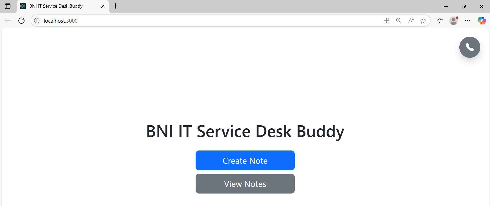
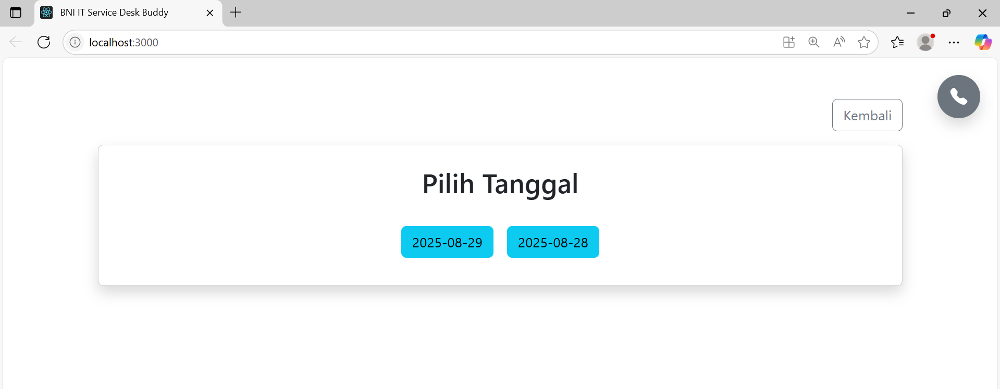
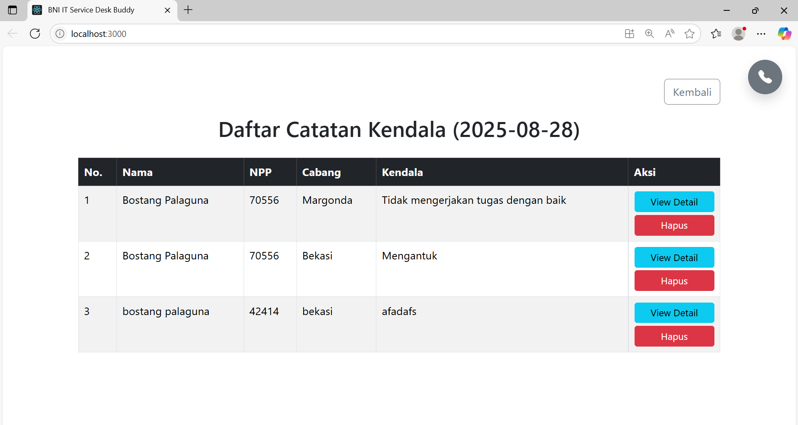
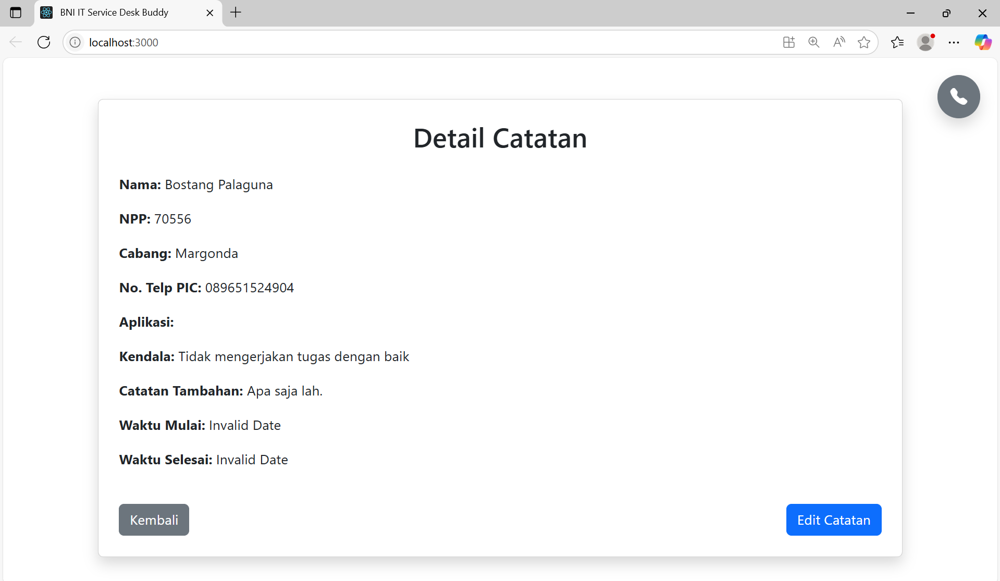
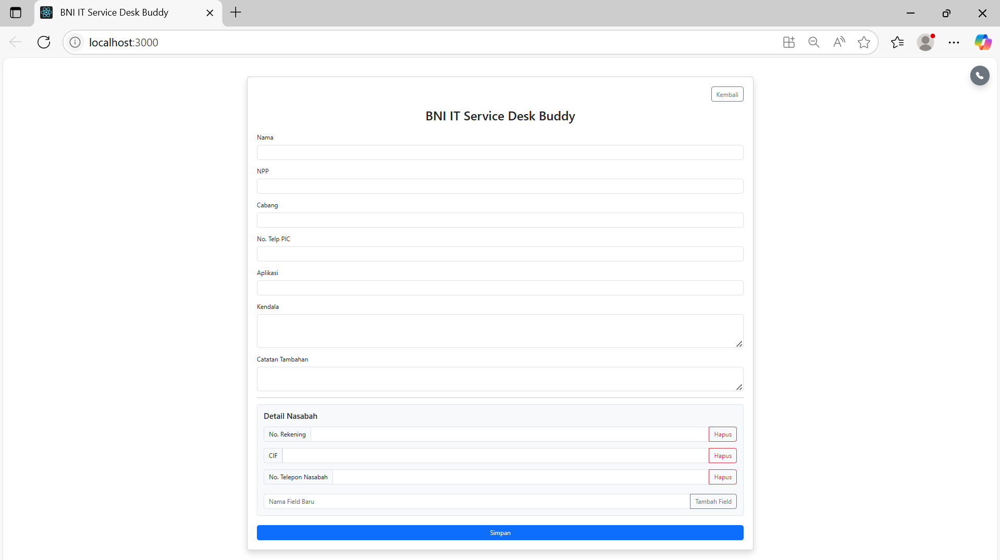

# Aplikasi Pencatatan Kendala Harian

Aplikasi web sederhana untuk mencatat kendala harian, dilengkapi dengan fitur penyimpanan data harian, tampilan, pengeditan, dan penghapusan catatan. Data disimpan dalam format JSON berdasarkan tanggal.

## Tampilan Aplikasi

- landing page



- view Note



- daftar note



- detail note



- create Note



---

## Fitur Utama

- **`Create Note`**: Buat catatan baru dengan *form* yang dinamis, memungkinkan penambahan *field* khusus dan detail nasabah secara opsional.
- **`View Notes`**: Lihat semua catatan yang dibuat pada tanggal tertentu dalam format tabel yang ringkas.
- **`View Detail`**: Lihat detail lengkap dari catatan tertentu, termasuk semua *field* yang ditambahkan secara dinamis.
- **`Edit Note`**: Ubah data catatan yang sudah ada melalui *form* yang sama dengan saat pembuatan.
- **`Delete Note`**: Hapus catatan tertentu.
- **`Multi-Date Support`**: Navigasi dan kelola catatan dari tanggal-tanggal sebelumnya dengan mudah.
- **`Dynamic Fields`**: Tambahkan *field* kustom seperti No. Rekening, CIF, atau lainnya sesuai kebutuhan di bagian "Detail Nasabah".
- **`WhatsApp Message Generator`**: Secara otomatis menghasilkan pesan WhatsApp yang ringkas dari data catatan yang disimpan.

---

## Teknologi yang Digunakan

**Frontend**:

- **React.js**: Library JavaScript untuk membangun antarmuka pengguna.
- **Bootstrap**: Framework CSS untuk *styling* dan *responsiveness*.
- **Axios**: Klien HTTP untuk melakukan permintaan API ke *backend*.

**Backend**:

- **Node.js**: Lingkungan *runtime* JavaScript untuk menjalankan server.
- **Express.js**: Framework web Node.js untuk membangun REST API.
- **`fs` (File System)**: Modul bawaan Node.js untuk mengelola file JSON.
- **`cors`**: Middleware untuk mengizinkan permintaan dari domain yang berbeda.

---

## Struktur Proyek

Proyek ini dibagi menjadi dua bagian utama: `frontend` (aplikasi React) dan `backend` (server Node.js).

```tree
/nama-proyek
|-- /frontend
|   |-- /src
|   |   |-- /components
|   |   |   |-- DatePicker.js
|   |   |   |-- LandingPage.js
|   |   |   |-- NoteDetail.js
|   |   |   |-- NoteEdit.js
|   |   |   |-- NoteForm.js
|   |   |   |-- NoteList.js
|   |   |-- App.js
|   |   |-- index.js
|   |-- package.json
|
|-- /backend
|   |-- /data
|   |   |-- /records
|   |   |   |-- 2025-08-28.json
|   |   |   |-- 2025-08-29.json
|   |   |-- specialist.json
|   |-- server.js
|   |-- package.json
|
|-- README.md
```

- **`/frontend/src/components`**: Berisi semua komponen React yang dapat digunakan kembali.
- **`/backend/data/records`**: Folder ini secara otomatis dibuat oleh server untuk menyimpan file JSON catatan harian berdasarkan tanggal.
- **`/backend/data/specialist.json`**: File ini berisi data kontak untuk fitur tambahan seperti *autocomplete* PIC.

---

## Cara Menjalankan Aplikasi

Ikuti langkah-langkah di bawah ini untuk menjalankan aplikasi secara lokal.

### 1\. Menjalankan Backend

Buka terminal baru di direktori `backend`.

```bash
# Pindah ke direktori backend
cd backend

# Pasang dependensi
npm install

# Jalankan server
node server.js
```

Server akan berjalan di `http://localhost:5000`.

### 2\. Menjalankan Frontend

Buka terminal **baru** di direktori `frontend`.

```bash
# Pindah ke direktori frontend
cd frontend

# Pasang dependensi
npm install

# Jalankan aplikasi React
npm start
```
